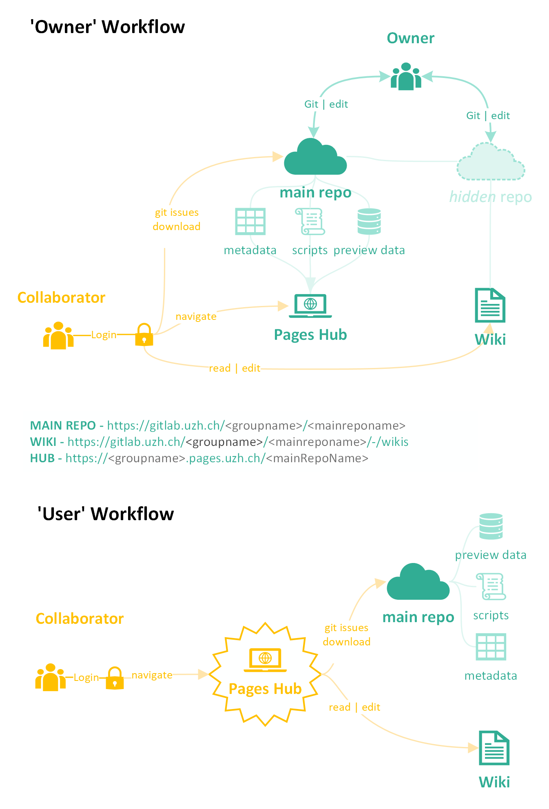

# Tutorial-0

## A Gitlab workflow to data sharing

The `owner` of the data (e.g., a lab or a researcher) creates and maintains a **main Gitlab repository** containing:

1. **Metadata**
2. **Data**, if applicable, e.g., thumbnail images
3. **Scripts to render** an HTML landing site, i.e. the Data Hub, which provides access for collaborators.
4. **Documentation** associated with those data is collected in the **Wiki** of the main repository. The markdown files composing the Wiki can be downloaded (they are stored is a separate repository) or they can be directly edited in the browser through the main repository. 

The materials will have three url locations, which can all be accessed through the Data Hub page:

1. The **Landing page** provides the interactive hub and links to the source metadata locations and the documentation.
2. The **main repository** to access the source metadata tables and data files
3. The **Wiki** to access all related documentation such as protocols and SOPs. The Wiki is alsa accessible through the main repository.

Any `collaborator` is given the landing page address and access credentials to it. From there they can access the three urls

{width=718 height=1058}