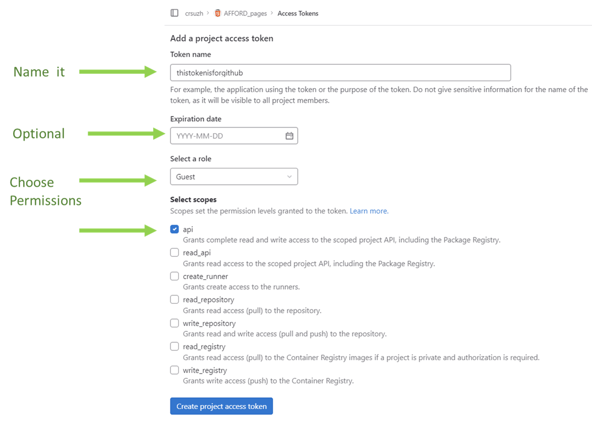
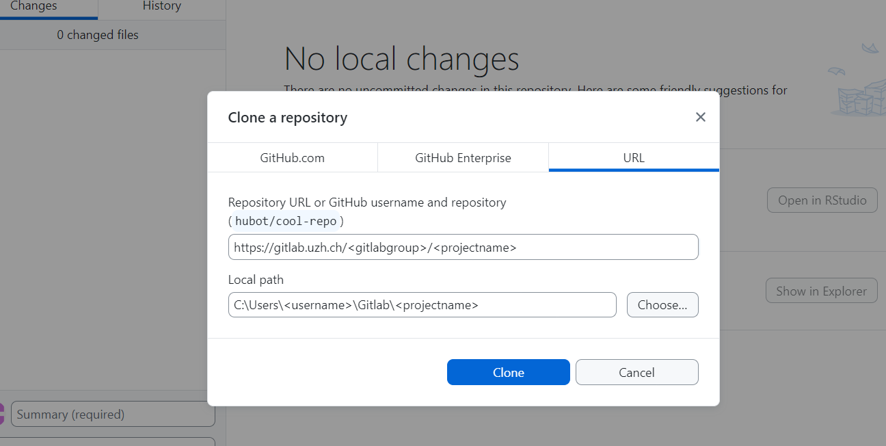

# Tutorial-1.-Using-Gitlab-for-Project-Owners-and-Collaborators.md

Step-by-step guide on Gitlab and a workflow to use Github Desktop to sync with local files. For more general info on repositories for code version control and why they are important, see the CRS primer on [digital collaboration](https://zenodo.org/record/7716291). The [Gitlab.uzh.ch](https://www.zi.uzh.ch/en/staff/software-elearning/webplatforms/gitlab.html) is hosted by the UZH on servers own by [SWITCH](https://www.switch.ch/de/edu-id/), a non-profit foundation that has been established by the Swiss Federal Government. Note that Git = the version control system; Gitlab = hosting service and software to store code in repositories and manage it with git version control; Github = a service similar to Gitlab

## 1\. Create a repository 

#### for _project owner(s)_

For someone that wants to share data or metadata (e.g., an hub)

1. **Login** with your SWITCH edu-id.
2. Create a **new project repository**, give it an informative, easy name (e.g., \_pages, or )
3. In Settings/General/**Visibility** mark it as private
4. In Manage/Members/**Invite members** add new members to the team, with different levels of permissions
5. Add your files and code (see Gitlab workflow)

#### for _collaborator(s)_

e.g., someone who wants to navigate through the data of other lab

1. Ask the owner of the data to be invited as a member of the project
2. Go to the project or Pages URL and login with Switch

## 2\. Cloning a repository (for owners)

Our remote Gitlab repository, which we access via the browser is now our main location of metadata, code (and some data). But sometimes it is convenient to make our edits locally. Specially if we are data **owners** and want to edit and share large number of files or code, we cannot edit this directly in the browser.

In Gitlab, you can `clone a repository` to create a copy into your computer, that will be synchronized with your remote repository. Once cloned we can `pull` changes done in the remote repository (in the browser). If we do local changes and want to 'send' them to the remote we do: 1) `commit` and 2) `push` the local changes to remote. NOTE: if we _fork_ a repository instead of instead of cloning it, this will create a completely independent copy of Git repository. Here, we need _cloning_ so that our local changes can be synchronize and we don't create duplicates of the repository.

### Personal access token

To clone a repository in your machine you will need most likely need a personal access token (due to the security of SWITCH login). In your Gitlab project, in the browser, go to `Settings/Access tokens`

See picture below. In the Access Tokens menu you will be able to give the token a `name`, choose an `expiration date` (or leave it blank), choose `permissions` (choose at least developer for making edits) and `scope` (select API).

{width="610" height="439"}

After this you will see a long alphanumeric string, the token, that you should save somewhere so you can use it as your `password` later on when using Github-desktop, Git or any other platform to manage local copies of the repositories.

### 2\.1 Cloning with Github-desktop (user-friendly)

This open source tool with a graphical user interface will simplify pull,commit,push operations for both advanced as well as new users. !Note: official support seems to be only for Windows and Mac. See further documentation on [integration with Gitlab](https://github.com/desktop/desktop/blob/development/docs/integrations/gitlab.md)

#### Setup for Gitlab

1. Download and install [Github desktop](https://desktop.github.com/)
2. In your Gitlab project, get your personal access token (see above) and save it somewhere
3. On Github desktop. Go to File/Clone repository. Then enter the URL of your Gitlab repository and a local directory name. For example:

   {width="551" height="277"}
4. The you will be asked for **username** and **pasword.** Your username is your Gitlab username (e.g, the name in your email address) and the password is the **Token** that you just created.

Now your Local folder is linked to your Gitlab remote repository. You can check now how to pull, commit, push changes.

#### Editing repository

Pull,commit and Push changes in the content of the repository. The workflow can get quite complex. Here we will ignore elements like _branches_ to oversimplify it into the main steps:

1. Work on your **local** repository, for example, create or edit code, update your metadata table, add new files \[^1\]
2. Open **Github desktop.** If you have several repositories, make sure you select the one you are currently working on or the one you want to update. It should detect the local changes done. If there are changes done remotely, but not locally, it willl prompt you to `pull` those changes (but here, beware there may be conflicts, which you shold be able to solve with Github but may complicate things).
3. Click `Commit` ( you will need to write a brief description, e.g., 'updated figures'). This will prepare your changes to be sent to the remote repository ('origin'). If you edited multiple scripts, you can commit all changes at once or select specific scripts
4. Click `push` to origin so that the changes are uploaded.

\[^1\]: Gitlab is not intended as a large data storage. For the pages in this example we need to have the pictures we want to render in the repository. But sometimes we have many files in our local repository that we do not want to push to the online repository. For that we can use a plain text file in that directory and call it `.gitignore` . In that file we can have statements like '\*.jpg'. Then Git will ignore all jpg files in the folder when pushing.

### 2\.2 Cloning with Git

Git refers to this version control system used in Gitlab, but you can also manage the repositories locally downloading the program [Git CSM](https://git-scm.com/download/win), a free and open source distributed version control system. It is light and works across operating systems, and also has a very basic graphical interface. But it is mostly designed for working through a terminal. As in Github-desktop you use this to do the main Git actions of _pulling_, _committing_ and _pushing_ changes between local and remote repositories.

