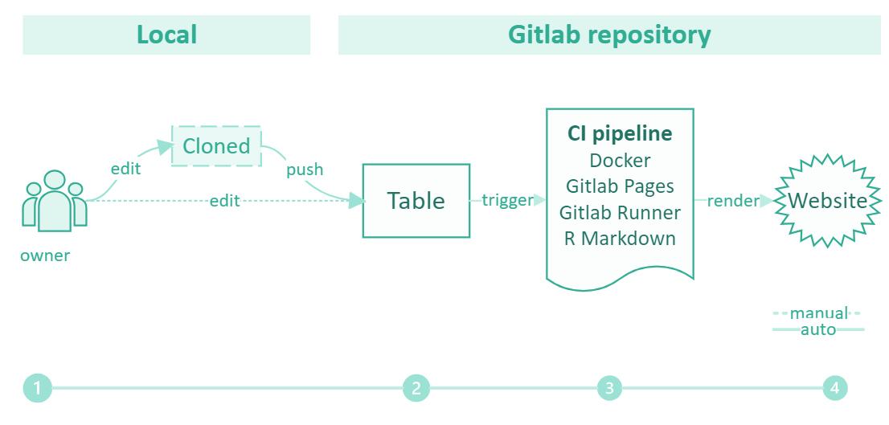

# Tutorial-2.-Creating-and-Updating-a-Data-Hub-in-Gitlab.md

The _static site_ generated in this repository shows an _interactive table_ with image thumbnails (clickable). By _static_ we mean that the user will just see whatever data is contained in the HTML of the site. Although it contains an interactive table, all users have access to the same data which they cannot modify (unlike in _dynamic websites_).

The website hosted using [Gitlab pages](shttps://docs.gitlab.com/ee/user/project/pages/) is rendered with an \[R Markdown\] (https://rmarkdown.rstudio.com/) script, that uses the R [DT package](https://rstudio.github.io/DT/)). The script creates an interactive page in HTML. [Gitlab CI](https://docs.gitlab.com/ee/ci/) is used to run the R Markdown script automatically at each update (push) and render the site from the browser so that users do not need to install R or other programs to update the site. 

[[_TOC_]]

# Workflow for data owners

{width="820" height="392"}

### 1\. ACTION: Owner edits **metadata**

The _owner_ can do this through:

1. _Browser_ (_RECOMMENDED FOR MINOR CHANGES_) Making changes from Gitlab in the browser (upload or edit file)
2. _Clone repository_ (_RECOMMENDED FOR MAJOR UPDATES_) Cloning this repo, working locally and _committing_ and _pushing_ the changes to Gitlab (e.g., using [Github desktop](https://desktop.github.com/)). The local metadata file should be always in Sync with that one in the remote repository.

NOTE: The files in the Gitlab repository should be considered as the _main source_ for retrieving your projects' metadata.

### 2\. AUTO: changes in the repository **trigger the Continuous Integration pipeline**

It may take around 5 minutes to update the page html. The member with at least `maintainer` status can click on Build/Pipelines or Jobs (sidebar in Gitlab) to see what pipeline or job (within pipeline) is running, and if there are any errors.

### 3\. AUTO: the continuous integration pipeline **runs the script**

The _.gitlab-ci.yml_ file defines this pipeline. It uses a Docker image with R, Gitlab pages to produce the website, and Gitlab runner to run the Docker where we have our Rmarkdown script (rendering the html from the table). The owner can edit the yml and the Rmarkdown to make if changes in this flow are to be done. No edit of Docker image is needed.

See our tutorial on customizing Gitlab Continuous Integration for more advanced details. 

### 4\. AUTO: The HTML is updated and collaborators can navigate through the updated data

# Files

The main **input files** are:

* `metadata table` (preferrably in .csv format for interoperability). It should contain just the filename of the pictures that will be displayed
* `images` files (**Note**: Gitlab is not meant for data storage. Images should be compressed to avoid exceeding volume allowed per repo ( usually 5 Gb in free versions, [details here](https://about.gitlab.com/pricing/faq-paid-storage-transfer/))
* `R markdown` script that has the code to render the table with DT package
* A `.gitlab-ci.yml` file is the Continuous integration file that makes it possible to run the Rmd file and render the html again from Gitlab

The **outputs** for the website

* `index.html` file within the public folder
* An ' _files_' folder will be saved if the table is rendered as self-contained

**Note**: _index.html_ and _images folder_ ARE EXPECTED to be saved in the `public` folder. This does not mean they are publicly accessible (you need login to access this site)

# Privacy

This is a `private` repository and a private site

* **Accounts**. A `SWITCH` account is required to access the static website and the repository with the code to generate it
* **Members**. A `maintainer` member in this repository can add new members (Go to Manage/Members). They must be also maintainer to be able to access the images after clicking on the table thumbnail. `Guests` can only see the thumbnails