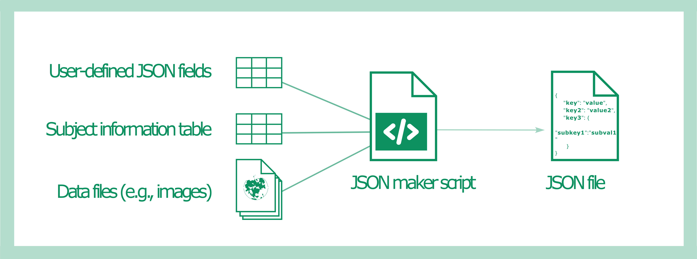

 
{width="659"}

# 1. Creating JSON files from a metadata table

In this tutorial, we will show you how to create simple human and machine-readable metadata files in JavaScript Object Notation [(JSON)](https://www.json.org/json-en.html). JSON files consist of fields of key-value pairs. These are *sidecar* metadata files, that is, they accompany a separate source data file and provide essential information about the data.

JSON metadata files differ from structured metadata files (i.e., tables) because of their machine-readability. While structured metadata files may contain human-only readable columns (e.g., "comment" columns with free-text notes), JSON files should not. However, they can have more details than the metadata tables.

::: {.callout-tip collapse="false"}
## Making JSON files

Good editors with a graphical interface are available online to read and write JSON files. We recommend the following: <https://jsoneditoronline.org/>

However, we recommend creating JSON files with a script and not manually to save time and prevent data entry errors. We will demonstrate how in this tutorial.
:::

## 1.1 Setting the stage for this tutorial

Here, we will work with an example situation derived from an imaging experiment. We will automate the creation of a JSON file from a metadata table containing image file names and locations, as well as information about the images (e.g., subject ID, subject sex, condition in which the subject was observed, treatment the subject received).

#### Requirements for creating the JSON files

-   Metadata table, containing the name of the reference images and metadata. *If relying entirely on the metadata on these tables (provided they have sufficient information) we do not require access to the actual files.*

-   Potentially, additional table(s) with JSON fields. The JSON files will therefore have additional information not found in the metadata table.

-   Description of filenaming convention, *codebook (i.e., ?)*, and glossary of abbreviations used in the metadata table

-   The [jsonlite](https://cran.r-project.org/web/packages/jsonlite/index.html) R package, used to write the JSON string

-   Naturally, some R code

## 1.2 Let's get to work!

Let's assume a relatively common structure for the dummy dataset we'll be using for this tutorial:

``` {style="background-color: WhiteSmoke"}
#| eval: false
experiment_results   # The base folder of our dataset
│
├── ...   # Folder(s) with other kinds of data
│
└── imaging   # The folder containing the imaging data
      │
      ├── ...
      │
      └── subject_n   # Each measured subject has a folder
            │ 
            └── subject_n_imgfile.tiff  # The image file

 
```

The code we provide will parse a dummy metadata table to create one JSON file for each row of the table, which describes one data file (in this case, an image). Our script thus will generate companion files for all image files, as necessary for machine readability. 

::: {.callout-warning appearance="minimal" collapse="false"}
# Machine readability

As we are automating a task, it's essential that our metadata table is formatted to be machine readable. This means that when preparing the table one should have paid attention to (among others) avoiding blank rows, if possible avoiding empty cells, using only the first row for header information (i.e. variable names).

Futhermore, the metadata table should be part of a spreadsheet also containing a *codebook* explaining what each variable is. The number of variables (= the number of columns) and their names in the metadata tables should be the same in the codebook.

For further information on readability of spreadsheets, see the [Six tips for better spreadsheets](https://doi.org/10.1038/d41586-022-02076-1) by J.M. Perkel .

:::


::: {.cell}

```{.r .cell-code}
# these packages are required for correct functioning of the tutorial

easypackages::packages("dplyr", # data operations
                       "kableExtra", # for rendering of tables in HTML or PDF
                       "knitr") # rendering of the report
```
:::


First of all, let's create a simple dummy (or toy) metadata table:


::: {.cell}

```{.r .cell-code}
n_rows = 30 # defining how many rows (in this case, how many study "subjects") we want in the table

metadata <- tibble(id = paste("subject", sprintf("%02d", 1:n_rows), sep = "_"), 
                   # this simply creates "subject_n" entries with n from 1 to n_rows
                   img_location = paste("experiment_results/imaging/subject_", 1:n_rows, "/subject_", 1:n_rows, "_imgfile.tiff", sep = ""),
                   sex = replicate(n_rows, sample(c("male", "female"), size=1), simplify = T),
                   # this and following lines will randomly fill a column with attributes chosen between a set of options (in this case, "male" or "female")
                   condition = replicate(n_rows, sample(c("A", "B"), size=1), simplify = T),
                   treatment = replicate(n_rows, sample(c("control", "treat_1", "treat_2", "treat_3"), size=1), simplify = T)
)
```
:::


Let's take a look:


::: {.cell}
::: {.cell-output-display}
`````{=html}
<div style="border: 1px solid #ddd; padding: 0px; overflow-y: scroll; height:300px; "><table>
 <thead>
  <tr>
   <th style="text-align:left;position: sticky; top:0; background-color: #FFFFFF;"> id </th>
   <th style="text-align:left;position: sticky; top:0; background-color: #FFFFFF;"> img_location </th>
   <th style="text-align:left;position: sticky; top:0; background-color: #FFFFFF;"> sex </th>
   <th style="text-align:left;position: sticky; top:0; background-color: #FFFFFF;"> condition </th>
   <th style="text-align:left;position: sticky; top:0; background-color: #FFFFFF;"> treatment </th>
  </tr>
 </thead>
<tbody>
  <tr>
   <td style="text-align:left;"> subject_01 </td>
   <td style="text-align:left;"> experiment_results/imaging/subject_1/subject_1_imgfile.tiff </td>
   <td style="text-align:left;"> male </td>
   <td style="text-align:left;"> B </td>
   <td style="text-align:left;"> treat_1 </td>
  </tr>
  <tr>
   <td style="text-align:left;"> subject_02 </td>
   <td style="text-align:left;"> experiment_results/imaging/subject_2/subject_2_imgfile.tiff </td>
   <td style="text-align:left;"> female </td>
   <td style="text-align:left;"> B </td>
   <td style="text-align:left;"> treat_3 </td>
  </tr>
  <tr>
   <td style="text-align:left;"> subject_03 </td>
   <td style="text-align:left;"> experiment_results/imaging/subject_3/subject_3_imgfile.tiff </td>
   <td style="text-align:left;"> male </td>
   <td style="text-align:left;"> A </td>
   <td style="text-align:left;"> control </td>
  </tr>
  <tr>
   <td style="text-align:left;"> subject_04 </td>
   <td style="text-align:left;"> experiment_results/imaging/subject_4/subject_4_imgfile.tiff </td>
   <td style="text-align:left;"> female </td>
   <td style="text-align:left;"> A </td>
   <td style="text-align:left;"> treat_3 </td>
  </tr>
  <tr>
   <td style="text-align:left;"> subject_05 </td>
   <td style="text-align:left;"> experiment_results/imaging/subject_5/subject_5_imgfile.tiff </td>
   <td style="text-align:left;"> female </td>
   <td style="text-align:left;"> B </td>
   <td style="text-align:left;"> treat_3 </td>
  </tr>
  <tr>
   <td style="text-align:left;"> subject_06 </td>
   <td style="text-align:left;"> experiment_results/imaging/subject_6/subject_6_imgfile.tiff </td>
   <td style="text-align:left;"> female </td>
   <td style="text-align:left;"> A </td>
   <td style="text-align:left;"> treat_3 </td>
  </tr>
  <tr>
   <td style="text-align:left;"> subject_07 </td>
   <td style="text-align:left;"> experiment_results/imaging/subject_7/subject_7_imgfile.tiff </td>
   <td style="text-align:left;"> male </td>
   <td style="text-align:left;"> A </td>
   <td style="text-align:left;"> treat_2 </td>
  </tr>
  <tr>
   <td style="text-align:left;"> subject_08 </td>
   <td style="text-align:left;"> experiment_results/imaging/subject_8/subject_8_imgfile.tiff </td>
   <td style="text-align:left;"> female </td>
   <td style="text-align:left;"> A </td>
   <td style="text-align:left;"> control </td>
  </tr>
  <tr>
   <td style="text-align:left;"> subject_09 </td>
   <td style="text-align:left;"> experiment_results/imaging/subject_9/subject_9_imgfile.tiff </td>
   <td style="text-align:left;"> male </td>
   <td style="text-align:left;"> B </td>
   <td style="text-align:left;"> treat_3 </td>
  </tr>
  <tr>
   <td style="text-align:left;"> subject_10 </td>
   <td style="text-align:left;"> experiment_results/imaging/subject_10/subject_10_imgfile.tiff </td>
   <td style="text-align:left;"> male </td>
   <td style="text-align:left;"> A </td>
   <td style="text-align:left;"> treat_1 </td>
  </tr>
  <tr>
   <td style="text-align:left;"> subject_11 </td>
   <td style="text-align:left;"> experiment_results/imaging/subject_11/subject_11_imgfile.tiff </td>
   <td style="text-align:left;"> male </td>
   <td style="text-align:left;"> B </td>
   <td style="text-align:left;"> control </td>
  </tr>
  <tr>
   <td style="text-align:left;"> subject_12 </td>
   <td style="text-align:left;"> experiment_results/imaging/subject_12/subject_12_imgfile.tiff </td>
   <td style="text-align:left;"> female </td>
   <td style="text-align:left;"> B </td>
   <td style="text-align:left;"> treat_1 </td>
  </tr>
  <tr>
   <td style="text-align:left;"> subject_13 </td>
   <td style="text-align:left;"> experiment_results/imaging/subject_13/subject_13_imgfile.tiff </td>
   <td style="text-align:left;"> female </td>
   <td style="text-align:left;"> B </td>
   <td style="text-align:left;"> treat_3 </td>
  </tr>
  <tr>
   <td style="text-align:left;"> subject_14 </td>
   <td style="text-align:left;"> experiment_results/imaging/subject_14/subject_14_imgfile.tiff </td>
   <td style="text-align:left;"> female </td>
   <td style="text-align:left;"> B </td>
   <td style="text-align:left;"> treat_2 </td>
  </tr>
  <tr>
   <td style="text-align:left;"> subject_15 </td>
   <td style="text-align:left;"> experiment_results/imaging/subject_15/subject_15_imgfile.tiff </td>
   <td style="text-align:left;"> female </td>
   <td style="text-align:left;"> B </td>
   <td style="text-align:left;"> control </td>
  </tr>
  <tr>
   <td style="text-align:left;"> subject_16 </td>
   <td style="text-align:left;"> experiment_results/imaging/subject_16/subject_16_imgfile.tiff </td>
   <td style="text-align:left;"> female </td>
   <td style="text-align:left;"> B </td>
   <td style="text-align:left;"> control </td>
  </tr>
  <tr>
   <td style="text-align:left;"> subject_17 </td>
   <td style="text-align:left;"> experiment_results/imaging/subject_17/subject_17_imgfile.tiff </td>
   <td style="text-align:left;"> female </td>
   <td style="text-align:left;"> B </td>
   <td style="text-align:left;"> treat_1 </td>
  </tr>
  <tr>
   <td style="text-align:left;"> subject_18 </td>
   <td style="text-align:left;"> experiment_results/imaging/subject_18/subject_18_imgfile.tiff </td>
   <td style="text-align:left;"> female </td>
   <td style="text-align:left;"> B </td>
   <td style="text-align:left;"> treat_3 </td>
  </tr>
  <tr>
   <td style="text-align:left;"> subject_19 </td>
   <td style="text-align:left;"> experiment_results/imaging/subject_19/subject_19_imgfile.tiff </td>
   <td style="text-align:left;"> male </td>
   <td style="text-align:left;"> A </td>
   <td style="text-align:left;"> treat_1 </td>
  </tr>
  <tr>
   <td style="text-align:left;"> subject_20 </td>
   <td style="text-align:left;"> experiment_results/imaging/subject_20/subject_20_imgfile.tiff </td>
   <td style="text-align:left;"> female </td>
   <td style="text-align:left;"> A </td>
   <td style="text-align:left;"> treat_1 </td>
  </tr>
  <tr>
   <td style="text-align:left;"> subject_21 </td>
   <td style="text-align:left;"> experiment_results/imaging/subject_21/subject_21_imgfile.tiff </td>
   <td style="text-align:left;"> male </td>
   <td style="text-align:left;"> B </td>
   <td style="text-align:left;"> treat_2 </td>
  </tr>
  <tr>
   <td style="text-align:left;"> subject_22 </td>
   <td style="text-align:left;"> experiment_results/imaging/subject_22/subject_22_imgfile.tiff </td>
   <td style="text-align:left;"> female </td>
   <td style="text-align:left;"> B </td>
   <td style="text-align:left;"> treat_3 </td>
  </tr>
  <tr>
   <td style="text-align:left;"> subject_23 </td>
   <td style="text-align:left;"> experiment_results/imaging/subject_23/subject_23_imgfile.tiff </td>
   <td style="text-align:left;"> female </td>
   <td style="text-align:left;"> A </td>
   <td style="text-align:left;"> treat_2 </td>
  </tr>
  <tr>
   <td style="text-align:left;"> subject_24 </td>
   <td style="text-align:left;"> experiment_results/imaging/subject_24/subject_24_imgfile.tiff </td>
   <td style="text-align:left;"> male </td>
   <td style="text-align:left;"> B </td>
   <td style="text-align:left;"> control </td>
  </tr>
  <tr>
   <td style="text-align:left;"> subject_25 </td>
   <td style="text-align:left;"> experiment_results/imaging/subject_25/subject_25_imgfile.tiff </td>
   <td style="text-align:left;"> female </td>
   <td style="text-align:left;"> B </td>
   <td style="text-align:left;"> control </td>
  </tr>
  <tr>
   <td style="text-align:left;"> subject_26 </td>
   <td style="text-align:left;"> experiment_results/imaging/subject_26/subject_26_imgfile.tiff </td>
   <td style="text-align:left;"> male </td>
   <td style="text-align:left;"> A </td>
   <td style="text-align:left;"> treat_2 </td>
  </tr>
  <tr>
   <td style="text-align:left;"> subject_27 </td>
   <td style="text-align:left;"> experiment_results/imaging/subject_27/subject_27_imgfile.tiff </td>
   <td style="text-align:left;"> female </td>
   <td style="text-align:left;"> A </td>
   <td style="text-align:left;"> treat_1 </td>
  </tr>
  <tr>
   <td style="text-align:left;"> subject_28 </td>
   <td style="text-align:left;"> experiment_results/imaging/subject_28/subject_28_imgfile.tiff </td>
   <td style="text-align:left;"> female </td>
   <td style="text-align:left;"> A </td>
   <td style="text-align:left;"> treat_3 </td>
  </tr>
  <tr>
   <td style="text-align:left;"> subject_29 </td>
   <td style="text-align:left;"> experiment_results/imaging/subject_29/subject_29_imgfile.tiff </td>
   <td style="text-align:left;"> male </td>
   <td style="text-align:left;"> A </td>
   <td style="text-align:left;"> treat_2 </td>
  </tr>
  <tr>
   <td style="text-align:left;"> subject_30 </td>
   <td style="text-align:left;"> experiment_results/imaging/subject_30/subject_30_imgfile.tiff </td>
   <td style="text-align:left;"> male </td>
   <td style="text-align:left;"> A </td>
   <td style="text-align:left;"> treat_1 </td>
  </tr>
</tbody>
</table></div>

`````
:::
:::


<p style="color:white;"> </p>
Now, let's make the corresponding JSON files. For readability purposes, here we use a for loop to iterate over the lines of the metadata table. This solution can be very slow when dealing with large metadata tables, so below we will illustrate an alternative, faster solution.


::: {.cell}

```{.r .cell-code}
library(jsonlite)
library(stringr)

saveoutput <- F # set to TRUE or T to automate JSON saving

for (i in 1:nrow(metadata)) {
  # Create JSON for current row
  row_metadata <- metadata %>% 
    slice(i)
  json_metadata <- toJSON(row_metadata, pretty = TRUE, auto_unbox = TRUE )
  
  if (saveoutput) {
    # create the output path for the JSON
    json_path  <- row_metadata %>% 
      pull(img_location) %>%  # this will give us the full path to the image
      str_replace(., ".tiff", ".json") # and this will remove the filename
    
    # write JSON file to appropriate location if triggered  
    write(json_metadata, file = json_path)
    print(paste0("Wrote ", json_path))
  }
  
}
```
:::


::: callout-tip
The code snippet you just saw includes the possibility to save the generated JSON files into the folders containing image files mentioned in the `img_location` column of the metadata table. If you want to use this functionality during your execution, simply change the `saveoutput` variable to `TRUE` or `T`.
:::

The `toJSON` function of `jsonlite` will convert anything in a table (in our case, a single row of the metadata table) into an R character vector of length 1, i.e. containing a single string. This one string is formatted according to the JSON format specifications. Here's how one of our JSON looks like:


::: {.cell}

```{.r .cell-code}
print(json_metadata)
```

::: {.cell-output .cell-output-stdout}

```
[
  {
    "id": "subject_30",
    "img_location": "experiment_results/imaging/subject_30/subject_30_imgfile.tiff",
    "sex": "male",
    "condition": "A",
    "treatment": "treat_1"
  }
] 
```


:::
:::


::: callout-note
Notice that the file starts with a `[` and ends with a `]`. The content of a row of the metadata table is delimited by `{}`. This delimited field contains `column_name:value` pairs in separate lines (separated by a newline, `\n`). Therefore, we could say that `toJSON` "expands" the row of the metadata table into a list describing each of its cells.
:::

And just like that, you've created your first JSON files. Congratulations!

## 1.3 Code

This is all the code that you'll need to execute what we talked about in this tutorial's section, grouped in one place.


::: {.cell}

```{.r .cell-code  code-fold="show"}
n_rows = 30 # defining how many rows (in this case, how many study "subjects") we want in the table

metadata <- tibble(id = paste("subject", sprintf("%02d", 1:n_rows), sep = "_"), 
                   # this simply creates "subject_n" entries with n from 1 to n_rows
                   img_location = paste("experiment_results/imaging/subject_", 1:n_rows, "/subject_", 1:n_rows, "_imgfile.tiff", sep = ""),
                   sex = replicate(n_rows, sample(c("male", "female"), size=1), simplify = T),
                   # this and following lines will randomly fill a column with attributes chosen between a set of options (in this case, "male" or "female")
                   condition = replicate(n_rows, sample(c("A", "B"), size=1), simplify = T),
                   treatment = replicate(n_rows, sample(c("control", "treat_1", "treat_2", "treat_3"), size=1), simplify = T)
)

library(jsonlite)
library(stringr)

saveoutput <- F # set to TRUE or T to automate JSON saving

for (i in 1:nrow(metadata)) {
  # Create JSON for current row
  row_metadata <- metadata %>% 
    slice(i)
  json_metadata <- toJSON(row_metadata, pretty = TRUE, auto_unbox = TRUE )
  
  if (saveoutput) {
    # create the output path for the JSON
    json_path  <- row_metadata %>% 
      pull(img_location) %>%  # this will give us the full path to the image
      str_replace(., ".tiff", ".json") # and this will remove the filename
    
    # write JSON file to appropriate location if triggered  
    write(json_metadata, file = json_path)
    print(paste0("Wrote ", json_path))
  }
  
}
```
:::


# 2. Creating JSON files with a metadata table and information from additional files


The example above was about the simplest possible situation you might encounter when creating JSON files. A more realistic situation you could encounter is that in which you have created a metadata table, but want to create JSON files combining its information with that present in other files. 

## 2.1 Setting the stage for this tutorial

In this part of the tutorial, we will create a script that allows you to customise the JSON-making process by editing a table that is used to specify which fields will be included in the JSON files. The information for these fields will be extracted from both the metadata table and the file names of the data files:  

{width="659"}

## 2.2 Requirements for creating the JSON files

-   A `.csv`-format table specifying JSON *keys* (e.g., "FacilityName", "GenusSpecies" ) and their *values* (e.g., "My_Lab" "Mus_Musculus") that apply to all data files; 

??(If a value is blank it will be filled by information in the file name or table with subject information (see below))

-   A collection of data files, with a subject ID encoded in their file name;

-   A metadata table with information on study subjects (e.g., sex, body weight) that can be added to the JSON file that will accompany each data file;

-   The [jsonlite](https://cran.r-project.org/web/packages/jsonlite/index.html) R package, used to write the JSON strings;

-   Naturally, some R code.

::: {.callout-note collapse="false" title="Metadata tables' file formats"}

Metadata tables should be prepared during data collection, or after it in edge cases, in a spreadsheet, and can be saved in different file formats (e.g., `.csv` or Excel `.xlsx`). For the sake of interoperability, the `.csv` file format is preferred.
:::

## 2.3 Let's get to work

This example will revolve around a dummy data set, meaning that the JSON fields and metadata have no real-life meaning. Let's imagine that this dummy data set contains microscopy images of plant tissues.

Let's assume a structure for the dummy dataset that is different than what we described before, and that is more common in research:

``` {style="background-color: WhiteSmoke"}
#| eval: false
experiment_results   # The base folder of our dataset
│
├── metadata.csv # metadata table with information on study subjects
│
├── ...   # Folder(s) with other kinds of data
│
└── imaging   # The folder containing the imaging data
      │
      ├── ...
      │
      └── subject_n_imgfile.tiff  # All image files are collected in a single folder

 
```

In this example, we have a `metadata.csv` table in the dataset base folder that contains one row per file present in the `imaging` sub-folder. Each row can contain the path to the imaging file and information on the study subject the file was derived from. Therefore, each row can contain both file- and experimental subject-specific information.

We will now create a dummy dataset following the structure we just reviewed, so that we can illustrate reading/writing automation as well.

Let's start by creating the dummy experimental dataset:


::: {.cell}

:::

::: {.cell}

```{.r .cell-code}
# we need to create a "tutorial" folder to organise input and output files
dataset_dir <- file.path("./Tutorial_Metadata_JSON/experiment_results") # will work on every OS
if (!dir.exists(dataset_dir)) {
  dir.create(dataset_dir, recursive = T)
}

# then, let's define how many study "subjects" we want in this example
n_subjects = 10 

# just to make things more interesting, let's come up with random subject IDs
subj_nrs <- sample(c(1:100), n_subjects, replace = FALSE)

# according to the dataset structure we defined above, we need to create an "imaging" folder
imaging_dir <- file.path(paste0(dataset_dir, "/imaging")) 
if (!dir.exists(imaging_dir)) {
  dir.create(imaging_dir)
}

# we will now create dummy data files, in this case dummy .tiff files, in the imaging folder

tiff_paths <- c()

for (n in subj_nrs) {
  
  # subject_dir <- file.path(paste0(imaging_dir, "/subject_", n))
  # dir.create(subject_dir)

  tiff_path <- file.path(paste0(imaging_dir, "/subject_", n, "_imgfile.tiff"))
  file.create(tiff_path)
  
  tiff_paths <- append(tiff_paths, tiff_path)
}

# let's not forget about creating a metadata table!

tibble(
# this simply creates "subject_n" entries with n from subj_nrs
  id = paste("subject", subj_nrs, sep = "_"), 
# this creates a column with paths to image files
  img_location = tiff_paths, # in this way, each file path is referred to the location of metadata.csv
# this and following lines will randomly fill a column with attributes chosen between a set of options (in the first case, "male" or "female")
  sex = replicate(n_subjects, sample(c("male", "female"), size=1), simplify = T),
  condition = replicate(n_subjects, sample(c("A", "B"), size=1), simplify = T),
  treatment = replicate(n_subjects, sample(c("control", "treat_1", "treat_2", "treat_3"), size=1), simplify = T)
) %>% 
# create the file
  write_csv(., file = file.path(dataset_dir, "dummyExp_metadata.csv"))

# and lastly, let's create the table with user-defined JSON fields
tibble(
json_section = c("info", "info", "info", "instrument", "instrument", "instrument", "img_processing",  "img_processing", "img_processing"),
variable_name = c("lab_name", "plant_species", "tissue_type", "microscope_model", "magnification", "filter", "binning", "masking", "counting"),
variable_description = c("location of sample analysis", NA, NA, "brand and model", NA, "name of filter applied", "was binning employed?", "employed masking approach", "employed counting algorithm"),
variable_type = c("string", "string", "string", "string", "numeric", "alphanumeric", "boolean", "string", "string"),
variable_values = c("labA", "Populus trichocarpa", "Shoot apical meristem", "brandX ABCmicro", 30, "filterA123", F, "methodX", "algoY")
) %>% 
  write_csv(., file = file.path(dataset_dir, "dummyExp_JSON_fields.csv"))
```
:::


Having created the dummy dataset, we can now move to the "operational" part of the tutorial, in which we'll work as if the dataset was real and we did not just create it. First, let's import the *metadata table* and the table with *user-defined JSON fields*:


::: {.cell}

```{.r .cell-code}
# Read table with user-defined JSON fields 
json_fields <- read_csv(file.path(dataset_dir,'dummyExp_JSON_fields.csv'))

# Read table with subject information
subj_info <- read_csv(file.path(dataset_dir,'dummyExp_metadata.csv'))
```
:::


### 2.3.1 Retrieving the subject IDs from imaging files

If our metadata table does not contain the location of each imaging file, we can always use the file names of the (dummy) images to retrieve it (let's just make sure that we match the locations with subject IDs):


::: {.cell}

```{.r .cell-code}
# Let's list all image files present in "imaging"
img_files <- list.files(file.path(dataset_dir,'imaging'),
                        full.names = TRUE, # retrieves complete paths relative to the working directory
                    pattern = ".tiff") # this will make list.files only list files with the ".tiff" suffix

# We'll then make a table out of them
files_tib <- tibble(path = img_files)

# We can use the fact that each image file name contains the subject ID to match file names and subject IDs in files_tib
files_tib <- files_tib %>% 
  mutate(fname = stringr::str_split_i(path, "/", -1)) %>% # split each "path" field at "/", take the last element only (so, the file name)
  mutate(subject = stringr::str_split_i(fname, "_img", 1))  %>% # split each "fname" field at "_img", take the first element only (so, the subject ID)
  select(!path) # this last line can be removed if the fil paths are not specified in the metadata table
```
:::


### 2.3.2 Checking the input tables

Before we proceed with creating JSON files, let's take a look at the various tables we will use.

::: panel-tabset

#### User-defined JSON fields


::: {.cell}
::: {.cell-output-display}
`````{=html}
<div style="border: 1px solid #ddd; padding: 0px; overflow-y: scroll; height:300px; "><table>
 <thead>
  <tr>
   <th style="text-align:left;position: sticky; top:0; background-color: #FFFFFF;"> json_section </th>
   <th style="text-align:left;position: sticky; top:0; background-color: #FFFFFF;"> variable_name </th>
   <th style="text-align:left;position: sticky; top:0; background-color: #FFFFFF;"> variable_description </th>
   <th style="text-align:left;position: sticky; top:0; background-color: #FFFFFF;"> variable_type </th>
   <th style="text-align:left;position: sticky; top:0; background-color: #FFFFFF;"> variable_values </th>
  </tr>
 </thead>
<tbody>
  <tr>
   <td style="text-align:left;"> info </td>
   <td style="text-align:left;"> lab_name </td>
   <td style="text-align:left;"> location of sample analysis </td>
   <td style="text-align:left;"> string </td>
   <td style="text-align:left;"> labA </td>
  </tr>
  <tr>
   <td style="text-align:left;"> info </td>
   <td style="text-align:left;"> plant_species </td>
   <td style="text-align:left;"> NA </td>
   <td style="text-align:left;"> string </td>
   <td style="text-align:left;"> Populus trichocarpa </td>
  </tr>
  <tr>
   <td style="text-align:left;"> info </td>
   <td style="text-align:left;"> tissue_type </td>
   <td style="text-align:left;"> NA </td>
   <td style="text-align:left;"> string </td>
   <td style="text-align:left;"> Shoot apical meristem </td>
  </tr>
  <tr>
   <td style="text-align:left;"> instrument </td>
   <td style="text-align:left;"> microscope_model </td>
   <td style="text-align:left;"> brand and model </td>
   <td style="text-align:left;"> string </td>
   <td style="text-align:left;"> brandX ABCmicro </td>
  </tr>
  <tr>
   <td style="text-align:left;"> instrument </td>
   <td style="text-align:left;"> magnification </td>
   <td style="text-align:left;"> NA </td>
   <td style="text-align:left;"> numeric </td>
   <td style="text-align:left;"> 30 </td>
  </tr>
  <tr>
   <td style="text-align:left;"> instrument </td>
   <td style="text-align:left;"> filter </td>
   <td style="text-align:left;"> name of filter applied </td>
   <td style="text-align:left;"> alphanumeric </td>
   <td style="text-align:left;"> filterA123 </td>
  </tr>
  <tr>
   <td style="text-align:left;"> img_processing </td>
   <td style="text-align:left;"> binning </td>
   <td style="text-align:left;"> was binning employed? </td>
   <td style="text-align:left;"> boolean </td>
   <td style="text-align:left;"> FALSE </td>
  </tr>
  <tr>
   <td style="text-align:left;"> img_processing </td>
   <td style="text-align:left;"> masking </td>
   <td style="text-align:left;"> employed masking approach </td>
   <td style="text-align:left;"> string </td>
   <td style="text-align:left;"> methodX </td>
  </tr>
  <tr>
   <td style="text-align:left;"> img_processing </td>
   <td style="text-align:left;"> counting </td>
   <td style="text-align:left;"> employed counting algorithm </td>
   <td style="text-align:left;"> string </td>
   <td style="text-align:left;"> algoY </td>
  </tr>
</tbody>
</table></div>

`````
:::
:::


#### Metadata


::: {.cell}
::: {.cell-output-display}
`````{=html}
<div style="border: 1px solid #ddd; padding: 0px; overflow-y: scroll; height:300px; "><table>
 <thead>
  <tr>
   <th style="text-align:left;position: sticky; top:0; background-color: #FFFFFF;"> id </th>
   <th style="text-align:left;position: sticky; top:0; background-color: #FFFFFF;"> img_location </th>
   <th style="text-align:left;position: sticky; top:0; background-color: #FFFFFF;"> sex </th>
   <th style="text-align:left;position: sticky; top:0; background-color: #FFFFFF;"> condition </th>
   <th style="text-align:left;position: sticky; top:0; background-color: #FFFFFF;"> treatment </th>
  </tr>
 </thead>
<tbody>
  <tr>
   <td style="text-align:left;"> subject_26 </td>
   <td style="text-align:left;"> ./Tutorial_Metadata_JSON/experiment_results/imaging/subject_26_imgfile.tiff </td>
   <td style="text-align:left;"> male </td>
   <td style="text-align:left;"> A </td>
   <td style="text-align:left;"> treat_3 </td>
  </tr>
  <tr>
   <td style="text-align:left;"> subject_83 </td>
   <td style="text-align:left;"> ./Tutorial_Metadata_JSON/experiment_results/imaging/subject_83_imgfile.tiff </td>
   <td style="text-align:left;"> male </td>
   <td style="text-align:left;"> A </td>
   <td style="text-align:left;"> treat_2 </td>
  </tr>
  <tr>
   <td style="text-align:left;"> subject_4 </td>
   <td style="text-align:left;"> ./Tutorial_Metadata_JSON/experiment_results/imaging/subject_4_imgfile.tiff </td>
   <td style="text-align:left;"> female </td>
   <td style="text-align:left;"> B </td>
   <td style="text-align:left;"> treat_2 </td>
  </tr>
  <tr>
   <td style="text-align:left;"> subject_2 </td>
   <td style="text-align:left;"> ./Tutorial_Metadata_JSON/experiment_results/imaging/subject_2_imgfile.tiff </td>
   <td style="text-align:left;"> male </td>
   <td style="text-align:left;"> A </td>
   <td style="text-align:left;"> treat_3 </td>
  </tr>
  <tr>
   <td style="text-align:left;"> subject_1 </td>
   <td style="text-align:left;"> ./Tutorial_Metadata_JSON/experiment_results/imaging/subject_1_imgfile.tiff </td>
   <td style="text-align:left;"> female </td>
   <td style="text-align:left;"> B </td>
   <td style="text-align:left;"> treat_2 </td>
  </tr>
  <tr>
   <td style="text-align:left;"> subject_34 </td>
   <td style="text-align:left;"> ./Tutorial_Metadata_JSON/experiment_results/imaging/subject_34_imgfile.tiff </td>
   <td style="text-align:left;"> male </td>
   <td style="text-align:left;"> B </td>
   <td style="text-align:left;"> treat_1 </td>
  </tr>
  <tr>
   <td style="text-align:left;"> subject_32 </td>
   <td style="text-align:left;"> ./Tutorial_Metadata_JSON/experiment_results/imaging/subject_32_imgfile.tiff </td>
   <td style="text-align:left;"> male </td>
   <td style="text-align:left;"> A </td>
   <td style="text-align:left;"> treat_2 </td>
  </tr>
  <tr>
   <td style="text-align:left;"> subject_6 </td>
   <td style="text-align:left;"> ./Tutorial_Metadata_JSON/experiment_results/imaging/subject_6_imgfile.tiff </td>
   <td style="text-align:left;"> male </td>
   <td style="text-align:left;"> B </td>
   <td style="text-align:left;"> control </td>
  </tr>
  <tr>
   <td style="text-align:left;"> subject_20 </td>
   <td style="text-align:left;"> ./Tutorial_Metadata_JSON/experiment_results/imaging/subject_20_imgfile.tiff </td>
   <td style="text-align:left;"> female </td>
   <td style="text-align:left;"> B </td>
   <td style="text-align:left;"> control </td>
  </tr>
  <tr>
   <td style="text-align:left;"> subject_86 </td>
   <td style="text-align:left;"> ./Tutorial_Metadata_JSON/experiment_results/imaging/subject_86_imgfile.tiff </td>
   <td style="text-align:left;"> male </td>
   <td style="text-align:left;"> A </td>
   <td style="text-align:left;"> treat_3 </td>
  </tr>
</tbody>
</table></div>

`````
:::
:::


#### Files' information


::: {.cell}
::: {.cell-output-display}
`````{=html}
<div style="border: 1px solid #ddd; padding: 0px; overflow-y: scroll; height:300px; "><table>
 <thead>
  <tr>
   <th style="text-align:left;position: sticky; top:0; background-color: #FFFFFF;"> fname </th>
   <th style="text-align:left;position: sticky; top:0; background-color: #FFFFFF;"> subject </th>
  </tr>
 </thead>
<tbody>
  <tr>
   <td style="text-align:left;"> subject_1_imgfile.tiff </td>
   <td style="text-align:left;"> subject_1 </td>
  </tr>
  <tr>
   <td style="text-align:left;"> subject_100_imgfile.tiff </td>
   <td style="text-align:left;"> subject_100 </td>
  </tr>
  <tr>
   <td style="text-align:left;"> subject_11_imgfile.tiff </td>
   <td style="text-align:left;"> subject_11 </td>
  </tr>
  <tr>
   <td style="text-align:left;"> subject_12_imgfile.tiff </td>
   <td style="text-align:left;"> subject_12 </td>
  </tr>
  <tr>
   <td style="text-align:left;"> subject_13_imgfile.tiff </td>
   <td style="text-align:left;"> subject_13 </td>
  </tr>
  <tr>
   <td style="text-align:left;"> subject_15_imgfile.tiff </td>
   <td style="text-align:left;"> subject_15 </td>
  </tr>
  <tr>
   <td style="text-align:left;"> subject_16_imgfile.tiff </td>
   <td style="text-align:left;"> subject_16 </td>
  </tr>
  <tr>
   <td style="text-align:left;"> subject_17_imgfile.tiff </td>
   <td style="text-align:left;"> subject_17 </td>
  </tr>
  <tr>
   <td style="text-align:left;"> subject_18_imgfile.tiff </td>
   <td style="text-align:left;"> subject_18 </td>
  </tr>
  <tr>
   <td style="text-align:left;"> subject_19_imgfile.tiff </td>
   <td style="text-align:left;"> subject_19 </td>
  </tr>
  <tr>
   <td style="text-align:left;"> subject_2_imgfile.tiff </td>
   <td style="text-align:left;"> subject_2 </td>
  </tr>
  <tr>
   <td style="text-align:left;"> subject_20_imgfile.tiff </td>
   <td style="text-align:left;"> subject_20 </td>
  </tr>
  <tr>
   <td style="text-align:left;"> subject_21_imgfile.tiff </td>
   <td style="text-align:left;"> subject_21 </td>
  </tr>
  <tr>
   <td style="text-align:left;"> subject_22_imgfile.tiff </td>
   <td style="text-align:left;"> subject_22 </td>
  </tr>
  <tr>
   <td style="text-align:left;"> subject_25_imgfile.tiff </td>
   <td style="text-align:left;"> subject_25 </td>
  </tr>
  <tr>
   <td style="text-align:left;"> subject_26_imgfile.tiff </td>
   <td style="text-align:left;"> subject_26 </td>
  </tr>
  <tr>
   <td style="text-align:left;"> subject_27_imgfile.tiff </td>
   <td style="text-align:left;"> subject_27 </td>
  </tr>
  <tr>
   <td style="text-align:left;"> subject_28_imgfile.tiff </td>
   <td style="text-align:left;"> subject_28 </td>
  </tr>
  <tr>
   <td style="text-align:left;"> subject_31_imgfile.tiff </td>
   <td style="text-align:left;"> subject_31 </td>
  </tr>
  <tr>
   <td style="text-align:left;"> subject_32_imgfile.tiff </td>
   <td style="text-align:left;"> subject_32 </td>
  </tr>
  <tr>
   <td style="text-align:left;"> subject_33_imgfile.tiff </td>
   <td style="text-align:left;"> subject_33 </td>
  </tr>
  <tr>
   <td style="text-align:left;"> subject_34_imgfile.tiff </td>
   <td style="text-align:left;"> subject_34 </td>
  </tr>
  <tr>
   <td style="text-align:left;"> subject_35_imgfile.tiff </td>
   <td style="text-align:left;"> subject_35 </td>
  </tr>
  <tr>
   <td style="text-align:left;"> subject_36_imgfile.tiff </td>
   <td style="text-align:left;"> subject_36 </td>
  </tr>
  <tr>
   <td style="text-align:left;"> subject_37_imgfile.tiff </td>
   <td style="text-align:left;"> subject_37 </td>
  </tr>
  <tr>
   <td style="text-align:left;"> subject_38_imgfile.tiff </td>
   <td style="text-align:left;"> subject_38 </td>
  </tr>
  <tr>
   <td style="text-align:left;"> subject_4_imgfile.tiff </td>
   <td style="text-align:left;"> subject_4 </td>
  </tr>
  <tr>
   <td style="text-align:left;"> subject_40_imgfile.tiff </td>
   <td style="text-align:left;"> subject_40 </td>
  </tr>
  <tr>
   <td style="text-align:left;"> subject_41_imgfile.tiff </td>
   <td style="text-align:left;"> subject_41 </td>
  </tr>
  <tr>
   <td style="text-align:left;"> subject_42_imgfile.tiff </td>
   <td style="text-align:left;"> subject_42 </td>
  </tr>
  <tr>
   <td style="text-align:left;"> subject_43_imgfile.tiff </td>
   <td style="text-align:left;"> subject_43 </td>
  </tr>
  <tr>
   <td style="text-align:left;"> subject_45_imgfile.tiff </td>
   <td style="text-align:left;"> subject_45 </td>
  </tr>
  <tr>
   <td style="text-align:left;"> subject_47_imgfile.tiff </td>
   <td style="text-align:left;"> subject_47 </td>
  </tr>
  <tr>
   <td style="text-align:left;"> subject_5_imgfile.tiff </td>
   <td style="text-align:left;"> subject_5 </td>
  </tr>
  <tr>
   <td style="text-align:left;"> subject_50_imgfile.tiff </td>
   <td style="text-align:left;"> subject_50 </td>
  </tr>
  <tr>
   <td style="text-align:left;"> subject_51_imgfile.tiff </td>
   <td style="text-align:left;"> subject_51 </td>
  </tr>
  <tr>
   <td style="text-align:left;"> subject_53_imgfile.tiff </td>
   <td style="text-align:left;"> subject_53 </td>
  </tr>
  <tr>
   <td style="text-align:left;"> subject_56_imgfile.tiff </td>
   <td style="text-align:left;"> subject_56 </td>
  </tr>
  <tr>
   <td style="text-align:left;"> subject_57_imgfile.tiff </td>
   <td style="text-align:left;"> subject_57 </td>
  </tr>
  <tr>
   <td style="text-align:left;"> subject_58_imgfile.tiff </td>
   <td style="text-align:left;"> subject_58 </td>
  </tr>
  <tr>
   <td style="text-align:left;"> subject_6_imgfile.tiff </td>
   <td style="text-align:left;"> subject_6 </td>
  </tr>
  <tr>
   <td style="text-align:left;"> subject_60_imgfile.tiff </td>
   <td style="text-align:left;"> subject_60 </td>
  </tr>
  <tr>
   <td style="text-align:left;"> subject_61_imgfile.tiff </td>
   <td style="text-align:left;"> subject_61 </td>
  </tr>
  <tr>
   <td style="text-align:left;"> subject_62_imgfile.tiff </td>
   <td style="text-align:left;"> subject_62 </td>
  </tr>
  <tr>
   <td style="text-align:left;"> subject_64_imgfile.tiff </td>
   <td style="text-align:left;"> subject_64 </td>
  </tr>
  <tr>
   <td style="text-align:left;"> subject_65_imgfile.tiff </td>
   <td style="text-align:left;"> subject_65 </td>
  </tr>
  <tr>
   <td style="text-align:left;"> subject_66_imgfile.tiff </td>
   <td style="text-align:left;"> subject_66 </td>
  </tr>
  <tr>
   <td style="text-align:left;"> subject_67_imgfile.tiff </td>
   <td style="text-align:left;"> subject_67 </td>
  </tr>
  <tr>
   <td style="text-align:left;"> subject_7_imgfile.tiff </td>
   <td style="text-align:left;"> subject_7 </td>
  </tr>
  <tr>
   <td style="text-align:left;"> subject_77_imgfile.tiff </td>
   <td style="text-align:left;"> subject_77 </td>
  </tr>
  <tr>
   <td style="text-align:left;"> subject_78_imgfile.tiff </td>
   <td style="text-align:left;"> subject_78 </td>
  </tr>
  <tr>
   <td style="text-align:left;"> subject_8_imgfile.tiff </td>
   <td style="text-align:left;"> subject_8 </td>
  </tr>
  <tr>
   <td style="text-align:left;"> subject_80_imgfile.tiff </td>
   <td style="text-align:left;"> subject_80 </td>
  </tr>
  <tr>
   <td style="text-align:left;"> subject_81_imgfile.tiff </td>
   <td style="text-align:left;"> subject_81 </td>
  </tr>
  <tr>
   <td style="text-align:left;"> subject_83_imgfile.tiff </td>
   <td style="text-align:left;"> subject_83 </td>
  </tr>
  <tr>
   <td style="text-align:left;"> subject_86_imgfile.tiff </td>
   <td style="text-align:left;"> subject_86 </td>
  </tr>
  <tr>
   <td style="text-align:left;"> subject_89_imgfile.tiff </td>
   <td style="text-align:left;"> subject_89 </td>
  </tr>
  <tr>
   <td style="text-align:left;"> subject_91_imgfile.tiff </td>
   <td style="text-align:left;"> subject_91 </td>
  </tr>
  <tr>
   <td style="text-align:left;"> subject_92_imgfile.tiff </td>
   <td style="text-align:left;"> subject_92 </td>
  </tr>
  <tr>
   <td style="text-align:left;"> subject_93_imgfile.tiff </td>
   <td style="text-align:left;"> subject_93 </td>
  </tr>
  <tr>
   <td style="text-align:left;"> subject_94_imgfile.tiff </td>
   <td style="text-align:left;"> subject_94 </td>
  </tr>
  <tr>
   <td style="text-align:left;"> subject_95_imgfile.tiff </td>
   <td style="text-align:left;"> subject_95 </td>
  </tr>
  <tr>
   <td style="text-align:left;"> subject_97_imgfile.tiff </td>
   <td style="text-align:left;"> subject_97 </td>
  </tr>
  <tr>
   <td style="text-align:left;"> subject_98_imgfile.tiff </td>
   <td style="text-align:left;"> subject_98 </td>
  </tr>
  <tr>
   <td style="text-align:left;"> subject_99_imgfile.tiff </td>
   <td style="text-align:left;"> subject_99 </td>
  </tr>
</tbody>
</table></div>

`````
:::
:::


:::

The `json_fields` table we created contains the column **variable_name** that contains what will be the *key*, and the column **variable_values** which contains what will be the *values* in the JSON file. The other columns are not necessary for this example, but can help the users when specifying the content of their JSON files. 

??The entries in **permissible_values** will be filled with file-specific information.

::: {.callout-important title="Naming and contents of columns"}
The names of the `json_fields` columns are arbitrary and you can define any other name. It is important to note the format of the values (e.g., numeric, alphanumeric or strings). The values can also be arrays, e.g. `[1,2,3]`. Note that a JSON file can have a more hierarchical structure, with keys and sub-keys, but we will keep things simple for this example.
:::

### 2.3.3 Creating the JSON files

First, we'll need to convert the human-readable `json_fields` table specifying the JSON fields into a suitable format for `jsonlite::toJSON()`:


::: {.cell}

```{.r .cell-code  code-fold="show"}
# Preserve the order of the field names as in the table
ordered_fieldnames <- factor(json_fields$variable_name, levels = json_fields$variable_name) 

# Transform table into a list. Each element is a field name with its value(s)
json_data <- lapply(split(json_fields$variable_values, ordered_fieldnames), as.character)
```
:::


::: {.callout-note title="Key-value pairs formats"}
You'll notice that the second line of code we just looked applies the `as.character()` function to each key-value pair we created from `json_fields`. This will keep everything consistent in the resulting JSON files, but `jsonlite` can handle multiple data types, such as dates, integer and real numbers, and more.
:::

We now can loop over the image files and create a JSON file for each of them. Besides the information we provided with the `[...]_JSON_fields.csv` file (which will be the same for each JSON), we can add image-specific information to each file. We will retrieve this information from the metadata table.


::: {.cell}

```{.r .cell-code}
# Join tables with filen ames and subject information by subject ID
metadata <- dplyr::full_join(x=files_tib, y=subj_info, by=join_by('subject'=='id'), keep=FALSE)

# write JSON files 
saveoutput <- T
for (i in 1:nrow(files_tib)) {
  
  # Complete Fields with info From table 
  json_data$subjectID = metadata$subject[i]
  json_data$sex = metadata$sex[i]
  json_data$condition = metadata$condition[i]
  json_data$treatment = metadata$treatment[i]
  
  
  # Convert the list to a JSON string
  json_string <- toJSON(json_data, pretty = TRUE, auto_unbox = TRUE)
  
  # Save the JSON string to a file
  if (saveoutput) {
    output_fname <- gsub('\\.\\D+$','.json',metadata$img_location[i]) # rename input file
    
    write(json_string, file.path(output_fname))  
    print(paste0("Wrote ", file.path(output_fname)))
  }
  
  # clean json 
  rm (json_string)
}
```
:::


### 2.3.4 Output Examples

The `jsonlite` package offers several encoding formatting options. You can check out all of them [online](https://cran.r-project.org/web/packages/jsonlite/index.html), and here are we illustrate the most relevant formatting possibilities:

(@) The `pretty` option of the `toJSON` function controls the appearance of the JSON output by adding indentation if set to TRUE.

::: panel-tabset
#### JSON with pretty = FALSE


::: {.cell}

```{.r .cell-code}
print(toJSON(json_data, pretty = FALSE, auto_unbox = TRUE))
```

::: {.cell-output .cell-output-stdout}

```
{"lab_name":"labA","plant_species":"Populus trichocarpa","tissue_type":"Shoot apical meristem","microscope_model":"brandX ABCmicro","magnification":"30","filter":"filterA123","binning":"FALSE","masking":"methodX","counting":"algoY","subjectID":"subject_99","sex":null,"condition":null,"treatment":null} 
```


:::
:::


#### JSON with pretty = TRUE


::: {.cell}

```{.r .cell-code}
print(toJSON(json_data, pretty = TRUE, auto_unbox = TRUE))
```

::: {.cell-output .cell-output-stdout}

```
{
  "lab_name": "labA",
  "plant_species": "Populus trichocarpa",
  "tissue_type": "Shoot apical meristem",
  "microscope_model": "brandX ABCmicro",
  "magnification": "30",
  "filter": "filterA123",
  "binning": "FALSE",
  "masking": "methodX",
  "counting": "algoY",
  "subjectID": "subject_99",
  "sex": null,
  "condition": null,
  "treatment": null
} 
```


:::
:::


:::

(@) The `auto_unbox` option of the `toJSON` function, when set to TRUE, ensures that items that are not part of lists are displayed correctly.

::: panel-tabset
#### JSON with auto_unbox = FALSE


::: {.cell}

```{.r .cell-code}
print(toJSON(json_data, pretty = TRUE, auto_unbox = FALSE))
```

::: {.cell-output .cell-output-stdout}

```
{
  "lab_name": ["labA"],
  "plant_species": ["Populus trichocarpa"],
  "tissue_type": ["Shoot apical meristem"],
  "microscope_model": ["brandX ABCmicro"],
  "magnification": ["30"],
  "filter": ["filterA123"],
  "binning": ["FALSE"],
  "masking": ["methodX"],
  "counting": ["algoY"],
  "subjectID": ["subject_99"],
  "sex": [null],
  "condition": [null],
  "treatment": [null]
} 
```


:::
:::


#### JSON with auto_unbox = TRUE


::: {.cell}

```{.r .cell-code}
print(toJSON(json_data, pretty = TRUE, auto_unbox = TRUE))
```

::: {.cell-output .cell-output-stdout}

```
{
  "lab_name": "labA",
  "plant_species": "Populus trichocarpa",
  "tissue_type": "Shoot apical meristem",
  "microscope_model": "brandX ABCmicro",
  "magnification": "30",
  "filter": "filterA123",
  "binning": "FALSE",
  "masking": "methodX",
  "counting": "algoY",
  "subjectID": "subject_99",
  "sex": null,
  "condition": null,
  "treatment": null
} 
```


:::
:::


:::

## 2.4 Code

This is all the code that you'll need to execute what we talked about in this tutorial's section, grouped in one place.


::: {.cell}

```{.r .cell-code  code-fold="show"}
# Read table with user-defined JSON fields 
json_fields <- read_csv(file.path(dataset_dir,'dummyExp_JSON_fields.csv'))

# Read table with subject information
subj_info <- read_csv(file.path(dataset_dir,'dummyExp_metadata.csv'))


# Let's list all image files present in "imaging"
img_files <- list.files(file.path(dataset_dir,'imaging'),
                        full.names = TRUE, # retrieves complete paths relative to the working directory
                    pattern = ".tiff") # this will make list.files only list files with the ".tiff" suffix

# We'll then make a table out of them
files_tib <- tibble(path = img_files)

# We can use the fact that each image file name contains the subject ID to match file names and subject IDs in files_tib
files_tib <- files_tib %>% 
  mutate(fname = stringr::str_split_i(path, "/", -1)) %>% # split each "path" field at "/", take the last element only (so, the file name)
  mutate(subject = stringr::str_split_i(fname, "_img", 1))  %>% # split each "fname" field at "_img", take the first element only (so, the subject ID)
  select(!path) # this last line can be removed if the fil paths are not specified in the metadata table
# Preserve the order of the field names as in the table
ordered_fieldnames <- factor(json_fields$variable_name, levels = json_fields$variable_name) 

# Transform table into a list. Each element is a field name with its value(s)
json_data <- lapply(split(json_fields$variable_values, ordered_fieldnames), as.character)


# Join tables with filen ames and subject information by subject ID
metadata <- dplyr::full_join(x=files_tib, y=subj_info, by=join_by('subject'=='id'), keep=FALSE)

# write JSON files 
saveoutput <- T
for (i in 1:nrow(files_tib)) {
  
  # Complete Fields with info From table 
  json_data$subjectID = metadata$subject[i]
  json_data$sex = metadata$sex[i]
  json_data$condition = metadata$condition[i]
  json_data$treatment = metadata$treatment[i]
  
  
  # Convert the list to a JSON string
  json_string <- toJSON(json_data, pretty = TRUE, auto_unbox = TRUE)
  
  # Save the JSON string to a file
  if (saveoutput) {
    output_fname <- gsub('\\.\\D+$','.json',metadata$img_location[i]) # rename input file
    
    write(json_string, file.path(output_fname))  
    print(paste0("Wrote ", file.path(output_fname)))
  }
  
  # clean json 
  rm (json_string)
}
```
:::

